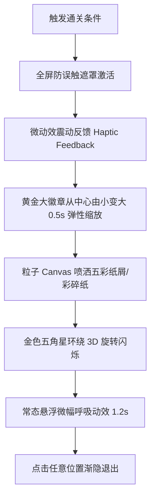
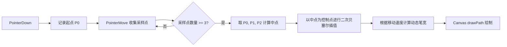

# 儿童趣味全栈考试系统 PRD 增强方案设计规范

本规范旨在优化“儿童趣味全栈考试系统”的 UI/UX，实现极致丝滑的交互体验，并增强家校端的核心实用性，使系统具备极佳的教育温度与工程落地可行性。

---

## 一、 UI 与视觉优化：卡通配色与高情绪价值动态反馈

### 1.1 卡通配色系统升级
为降低小学生长时间面对屏幕的视觉疲劳，并保持欢快、活泼的心理感受，采用**马卡龙低饱和度色系（儿童友好）**。
- **主色调（教育蓝）：** `#5C9DFF` (天蓝色，RGB: 92, 157, 255) —— 稳定、专注
- **辅助色（晨光黄）：** `#FFD043` (暖黄色，RGB: 255, 208, 67) —— 趣味、高光
- **成功色（薄荷绿）：** `#66D2A3` (浅绿色，RGB: 102, 210, 163) —— 正确、通关
- **警示色（樱花粉）：** `#FF8F9F` (暖粉色，RGB: 255, 143, 159) —— 温和提示，规避刺眼的纯红色
- **中性背景色：** `#F7FAFC` (护眼奶白，RGB: 247, 250, 252)

### 1.2 成功通关“超级大徽章”黄金级动效
学生完成考试或满分通关时，触发全屏级情绪反馈，极大地激发儿童的成就感。

#### 动效技术参数与体验细节：
1. **徽章弹出（Spring Animation）：** 采用 `transform: scale(0)` 至 `transform: scale(1.15)`，再回弹至 `1.0`。
   - `duration`: 500ms
   - `easing`: `cubic-bezier(0.175, 0.885, 0.32, 1.275)` (经典弹性曲线)
2. **彩带粒子喷洒（Confetti Particle System）：**
   - 使用 Canvas 渲染 80-120 个彩色碎片。
   - 粒子属性：随机角度（-45° 至 -135°）、初速度（15-25px/frame）、重力加速度（0.5px/frame²）、旋转阻尼。
   - 粒子渐变消失时间：1800ms。
3. **力反馈（Haptic Feedback）：** 在移动端（iPad/Android Tablet）调用 `navigator.vibrate([30, 50, 30])`，模拟敲击徽章的清脆物理质感。

---

## 二、 丝滑交互规范：极速 Canvas 书写与高保真橡皮擦

### 2.1 极速 Canvas 书写：贝塞尔曲线插值与手写防抖

为实现纸张般的平滑感，系统必须对原生 Touch/Pointer 事件进行防抖和插值处理，规避由于采样率低导致的折线锯齿。

#### 核心算法逻辑：
1. **贝塞尔插值：** 采用**二次/三次贝塞尔曲线插值算法**。在收到点 $P_i$ 时，以 $P_{i-1}$ 与 $P_i$ 的中点作为绘制弧线的端点，以 $P_{i-1}$ 作为控制点。
   $$\text{Curve}(t) = (1-t)^2 P_{i-2} + 2t(1-t)P_{i-1} + t^2 \left(\frac{P_{i-1} + P_i}{2}\right)$$
2. **压力感应/速度自适应笔宽：**
   - 速度 $v = \frac{\Delta \text{Distance}}{\Delta \text{Time}}$。
   - 笔宽 $W = W_{base} \times (1 - k \cdot \min(v, v_{max}))$，其中 $k$ 为压感阻尼系数。实现“快写则细，慢写则粗”的书写笔意。
3. **手写防抖（Debounce & Buffer）：**
   - 忽略物理抖动距离低于 1.5 像素的点。
   - 采用 `requestAnimationFrame` 异步缓冲渲染，将渲染延迟降至 8ms 内，确保 60fps/120fps 的丝滑输出。

### 2.2 笔画粗细预览与橡皮擦范围环
让学生“写得明白，擦得精准”，大幅提升操作自信心。

#### 1. 笔画粗细悬浮预览圈（Preview Circle）
*   **交互逻辑：** 当学生点击或调节“笔画粗细”滑竿时，在画笔图标上方或当前手指触碰点显现一个**半透明呼吸圆环**。
*   **视觉规格：** 填充色为当前画笔颜色（Alpha = 0.3），外围带 1px 细白边。圆环直径严格对应 Canvas 真实写入的像素直径。
*   **退出时机：** 调节停止 600ms 后自动渐隐消失。

#### 2. 橡皮擦范围环（Eraser Cursor Ring）
*   **痛点：** 传统橡皮擦没有范围提示，小学生极易误擦邻近的正确笔迹。
*   **交互规范：**
    *   一旦切换为橡皮擦工具，触控点下方立即显示一个**虚线靶心范围圆环**（直径等于橡皮擦除半径 $R$）。
    *   **样式：** 圆环边框使用 `#5C9DFF`（Alpha = 0.5）的 1px 虚线，圆环内部为微白 `#FFFFFF`（Alpha = 0.15）的半遮罩，使背景试卷字迹隐约可见。
    *   **动态碰撞：** 橡皮擦擦除范围环随手指移动而平滑移动。移动时，圆环边缘呈现微小的水滴形拖尾动效（微动效，表示“吸附并擦除”）。
    *   **局部擦除重绘：** 使用 Canvas `globalCompositeOperation = 'destination-out'` 仅清除擦除圆环相交区域的像素，确保非接触笔迹毫发无伤。

---

## 三、 强实用性家校交互

### 3.1 教师端：班级掌控力与趣味教学工具

#### 1. 一键撤回已发卷（防手抖发错）
*   **功能背景：** 教师端有时会误发未完成的试卷或发错班级，导致教学事故。
*   **回撤机制：**
    *   发卷后 **5分钟内**，提供显目的“一键撤回”金色按钮。
    *   **撤回逻辑：** 若学生尚未开始作答，直接无痕销毁学生端任务；若有学生已打开作答，弹出二次友好确认提示框（“已有 2 名学生点开试卷，确认全部撤回并清空其当前草稿吗？”）。
    *   **数据一致性：** 数据库底层采用软删除机制（`is_deleted=true`），清空 Redis 中的待分发队列，保障撤回操作瞬间完成，零延迟。

#### 2. 常用评语快捷红印章
*   **交互设计：** 还原真实的纸张改卷体验。教师在批改界面下方可选快捷印章盘。
*   **趣味印章列表：**
    *   `大有进步！⭐`（金色星星闪烁微光）
    *   `加油哦！☘️`（绿色四叶草旋转）
    *   `字迹工整！✍️`（钢笔书写划过波浪）
    *   `细心大王！🧐`（红圈放大镜）
*   **交互规格：** 教师选中印章后，在试卷对应位置“轻轻一戳”，即可落下一枚具有**微重力感应倾斜度**（随机倾斜 -3° 至 +3°）的拟真红印章。伴随“啪嗒”清脆盖章音效（音频文件长度 150ms，经过高频优化，无滞后感）。

### 3.2 学生端：安心书写与自由操作

#### 1. 自动定时草稿箱防丢（静默守护）
*   **运行机制：** 考试期间，系统每隔 **10秒** 自动触发一次静默本地备份。
*   **技术链路：**
    1.  Canvas 矢量数据（JSON 格式路径）与选择题答案被合并序列化。
    2.  数据写入本地 **IndexedDB**（存储容量大，读写极快，不占用 Cookie 和 LocalStorage 空间）。
    3.  上传网络成功后清空本地过期备份。
*   **异常恢复：** 当发生断网、误关闭浏览器、iPad 没电关机等致命故障时，重新开机进入系统，系统自动识别本地 IndexedDB 中的未提交草稿，弹出温和提示：*“小主人，发现你刚刚没写完的试卷，已经帮你找回来啦！✨”*，一键恢复 100% 书写数据。

#### 2. 试卷画布缩放与移动（Pinch & Zoom）
*   **设计挑战：** 单指既要进行 Canvas 书写，又要允许缩放画布，极易发生误触。
*   **交互防误触规范：**
    *   **单指操作：** 100% 判定为书写、选择或画笔轨迹。
    *   **双指捏合（Pinch）：** 判定为画布缩放。支持 $0.5\times$ 至 $3.0\times$ 自由无极缩放。
    *   **双指拖拽（Pan）：** 判定为试卷画布的平移与漫游。
    *   **手势冲突阻断：** 当双指触碰 Canvas 瞬间，系统强制挂起书写监听器，切换为缩放平移矩阵模式（CSS `transform: matrix`），并应用 **300ms 防误触缓冲期**，防止双指移开瞬间留下小点痕迹。
    *   **边缘回弹（Elastic Bounding）：** 试卷被拖拽超出边界 100px 时，松手后触发弹性回弹，平滑滚回可见区域，防止试卷丢失在屏幕外。

### 3.3 家长端：学习汇报与多场景温情设计

#### 1. 一键隐藏红笔迹（错题重温利器）
*   **功能痛点：** 家长辅导孩子时，希望孩子能重新做一遍错题，但试卷上满是老师的红笔批改和扣分，极其影响二次作答。
*   **功能设计：** 
    *   家长端界面右上角常设一个“一键隐藏老师批改”的眼睛图标。
    *   点击后，系统通过图层分离机制（试卷底层背景 vs 教师红笔迹图层），**静默渐隐（opacity: 0）** 教师书写的红色笔画、红印章及扣分文字。
    *   让学生能在干净的原题图层上重新草稿思考，完美解决“错题本重做”的家教强诉求。

#### 2. 一键生成“成长报告卡片”
*   **卡片设计：** 将枯燥的分数转换成温度满满、充满正面引导的成长明信片。
*   **卡片组成：**
    *   **视觉顶部：** 小学生通关头像，搭配金色勋章（如“今日细心达人”、“字迹工整小标兵”）。
    *   **视觉中部：** 老师对本次考试最温暖的一句评语（大字展示），以及成绩亮点雷达图（如“计算力 5★”、“专注力 4★”、“逻辑力 4.5★”）。
    *   **视觉底部：** 温馨的卡片边框（如星空蓝、森林绿卡通模板），自动生成带防伪标志的家校分享二维码。
*   **技术规格：**
    *   采用前端 **html2canvas / Modern Web Canvas API** 离屏渲染，直接导出 $1080 \times 1920$ 高清图片。
    *   提供“保存至相册”和“一键分享给班级群”功能，激发家长的正面分享欲。

---

## 四、 总结与体验度量指标（UX KPIs）

| 指标维度 | 评估参数 | 体验合格线 | 优秀线 | 监控方式 |
| :--- | :--- | :--- | :--- | :--- |
| **书写延迟** | Canvas 书写响应延迟 | $\le 16\text{ms}$ | $\le 8\text{ms}$ | 开发者工具 Performance 帧分析 |
| **防丢可靠性** | 异常断电/闪退数据找回率 | $\ge 98\%$ | $100\%$ | 异常流模拟埋点测试 |
| **误触率** | 单指书写与双指缩放误触几率 | $\le 3\%$ | $\le 0.5\%$ | 自动化触控手势脚本测试 |
| **卡片生成** | 报告卡片一键生成与下载耗时 | $\le 1500\text{ms}$ | $\le 800\text{ms}$ | 前端打点统计平均耗时 |

本 PRD 方案在兼顾儿童心理学的基础上，从极佳的书写算法、精细的擦除提示，到实用的撤回、防丢与错题功能，为家校共育场景提供了坚实、温暖的技术支柱。
